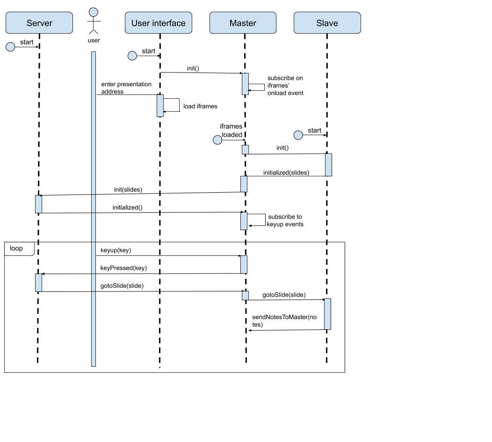

# Developer Guide
## Requirements
This whole application is written in javascript so [NodeJs](https://nodejs.org/download/) v8.0 is the minimal required installation.
## Usage
First of all clone the repository [here](https://github.com/sfeir-open-source/talk-control/)

Then install the dependencies
```sh
cd talk-control
npm i
```

Then run the project
```sh
npm start
```

## Core concepts
### TC-Server
In this system, tc-server, the backend act as the single source of truth. It stores the informations on the current slide and the total number of slides in the presentation. It will update this store with each event received from a master (see next section) and then dispatch other events with the changes to notify masters.
You can find the attached jsdoc [here](code/server/talk-control-server.md).

#### Events fired
- **initialized**: Fired once, the first time the server initialize its state. This initialization is triggered when an *'init'* event is fired from a master.
- **gotoSlide**: Every time when the current slide in the state changed.
 
### TC-Master
A master is the main controller of a view, it will mainly forward events between the server and its slaves.
It displays the slave(s) and listens for speaker actions (key pressed, etc...), and forward the events them to the server.
There are multiple master views, like :

-   The stage view : it displays the talk in an iframe in fullscreen.
-   The presenter view : it displays the current slide, a preview of the next one, a timer and the notes attached to the current slide.
#### Events fired
##### To server
- **init**: When the 'main' slave is initialized.
- **keyboardEvent**: Every time a useful key is pressed.
##### To slave
- **init**: When the master is initialized.
- **gotoSlide**: Forwarding the same event received from the server.
- **sendNotesToSlave**: Forwarding the notes given by a slave to the others who might need them.

### TC-Slave
A slave is a component with a specific job (for example : the slideshow, the timer, etc...) which updates itself whith the events fired by its master. The one acting as the 'main' slave is the one showing the current slide.
#### Events fired
- **initialized** : Only fired by the slaves which are contained in an iframe, when they're ready to start. The payload contains the number of slides and optionnaly an array of slides objects (like with Revealjs).
- **sendNotesToMaster** : Only fired by the 'main' slave every time it's current slide changes, it will send the attached notes to the master.

### Engines
Engines are classes that handle all presentation framework (referred later as just framework) related process. There are two implementation of them for each frameword one server side and one client side which will be instanciated on mutliple slaves.

**Server side** engine will handle every input event received and update the state accordingly. It's the only one which has the knowledge about how a slide is represented by the framework.

**Client side** engine will interract with the framework to update the view when a *```gotoSlide```* event is received by the slave. It's the only one with the knowledge of interracting with the framework.

### Global workflow
Here is a sequence diagram which illustrate the minimal global workflow of the application and the differents events emitted by each part.



## Contributing
See [contributing.md](https://github.com/sfeir-open-source/talk-control/blob/master/CONTRIBUTING.md)